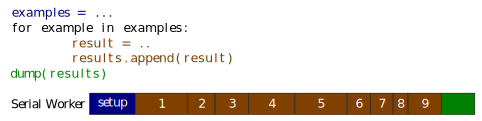
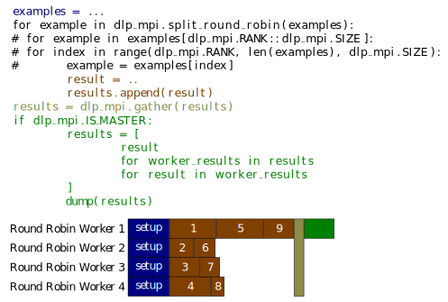
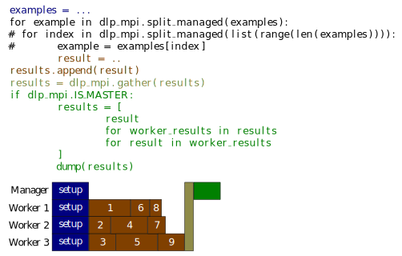
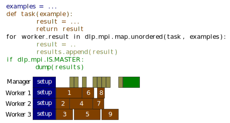

# dlp_mpi - Data-level parallelism with mpi for python

[](https://pypi.org/project/dlp-mpi)
[](https://pypi.org/project/dlp-mpi)
[](https://raw.githubusercontent.com/fgnt/dlp_mpi/master/LICENSE)

<table>
<tr>
<th>
Run an serial algorithm on multiple examples
</th>
<th>
Use dlp_mpi to run the loop body in parallel
</th>
<th>
Use dlp_mpi to run a function in parallel
</th>
</tr>
<tr>
<td>

```python
# python script.py

import time


examples = list(range(10))
results = []


for example in examples:

    # Some heavy workload:
    # CPU or IO
    time.sleep(0.2)
    result = example

    # Remember the results
    results.append(result)


# Summarize your experiment
print(sum(results))
```
</td>
<td>

```python
# mpiexec -np 8 python script.py

import time
import dlp_mpi

examples = list(range(10))
results = []


for example in dlp_mpi.split_managed(
        examples):
    # Some heavy workload:
    # CPU or IO
    time.sleep(0.2)
    result = example

    # Remember the results
    results.append(result)

results = dlp_mpi.gather(results)

if dlp_mpi.IS_MASTER:
    results = [
        result
        for worker_results in results
        for result in worker_results
    ]
    
    # Summarize your experiment
    print(results)
```
</td>
<td>

```python
# mpiexec -np 8 python script.py

import time
import dlp_mpi

examples = list(range(10))
results = []

def work_load(example):
    # Some heavy workload:
    # CPU or IO
    time.sleep(0.2)
    result = example
    return result

for result in dlp_mpi.map_unordered(
        work_load, examples):


    # Remember the results
    results.append(result)


if dlp_mpi.IS_MASTER:
    # Summarize your experiment
    print(results)
```
</td>
</tr>
</table>

This package uses `mpi4py` to provide utilities to parallelize algorithms that are applied to multiple examples.

The core idea is: Start `N` processes and each process works on a subset of all examples.
To start the processes `mpiexec` can be used. Most HPC systems support MPI to scatter the workload across multiple hosts. For the command, look in the documentation for your HPC system and search for MPI launches.

Since each process should operate on different examples, MPI provides the variables `RANK` and `SIZE`, where `SIZE` is the number of workers and `RANK` is a unique identifier from `0` to `SIZE - 1`.
The easiest way to improve the execution time is to process `examples[RANK::SIZE]` on each worker.
This is a round robin load balancing (`dlp_mpi.split_round_robin`).
A more advanced load balancing is `dlp_mpi.split_managed`, where one process manages the load and assigns a new task to a worker once he finishes the last task.

When in the end of a program all results should be summarized or written in a single file, communication between all processes is nessesary.
For this purpose `dlp_mpi.gather` (`mpi4py.MPI.COMM_WORLD.gather`) can be used. This function sends all data to the root process (Here, `pickle` is used for serialization).

As an alternative to splitting the data, this package also provides a `map` style parallelization (see example in the beginning):
The function `dlp_mpi.map_unordered` calls `work_load` in parallel and executes the `for` body in serial.
The communication between the processes is only the `result` and the index to get the `i`th example from the examples, i.e., the example aren't transferred between the processes.

# Runtime

Without this package your code runs in serial.
The execution time of the following code snippets will be demonstrated by running it with this package.
Regarding the color: The `examples = ...` is the setup code.
Therefore, the code and the correspoding block representing the execution time it is blue in the code.



This easiest way to parallelize the workload (dark orange) is to do a round robin assignment of the load:
`for example in dlp_mpi.split_round_robin(examples)`.
This function call is equivalent to `for example in examples[dlp_mpi.RANK::dlp_mpi.SIZE]`.
Thus, there is zero comunications between the workers.
Only when it is nessesary to do some final work on the results of all data (e.g. calculating average metrics) a communication is nessesary.
This is done with the `gather` function.
This functions returns the worker results in a list on the master process and the worker process gets a `None` return value.
Depending on the workload the round robin assingment can be suboptimal.
See the example block diagramm.
Worker 1 got tasks that are relative long.
So this worker used much more time than the others.



To overcome the limitations of the round robin assignment, this package helps to use a manager to assign the work to the workers.
This optimizes the utilisation of the workers.
Once a worker finished an example, it requests a new one from the manager and gets one assigned.
Note: The communication is only which example should be processed (i.e. the index of the example) not the example itself.



An alternative to splitting the iterator is to use a `map` function.
The function is then executed on a worker and the return value is sent back to the manager.
Be carefull, that the loop body is fast enough, otherwise it can be a bottleneck.
You should use the loop body only for book keeping, not for actual work load.
When a worker sends a task to the manager, the manager sends back a new task and enters the for loop body. 
While the manager is in the loop body, he cannot react on requests of other workers, see the block diagramm:




# Installation

You can install this package from pypi:
```bash
pip install dlp_mpi
```

To check if the installation was successful, try the following command:
```bash 
$ mpiexec -np 4 python -c 'import dlp_mpi; print(dlp_mpi.RANK)'
3
0
1
2
```
The command should print the numbers 0, 1, 2 and 3.
The order is random.
When that line prints 4 times a zero, something went wrong.

This can happen, when you have no `mpi` installed or the installation is brocken.
In a Debian-based Linux you can install it with `sudo apt install libopenmpi-dev`.
When you do not have the rights to install something with `apt`, you could also install `mpi4py` with `conda`.
The above `pip install` will install `mpi4py` from `pypi`.
Be careful, that the installation from `conda` may conflict with your locally installed `mpi`. 
Especially in High Performance Computing (HPC) environments this can cause troubles.

# FAQ

**Q**: Can I run a script that uses `dlp_mpi` on my laptop, that has no running MPI (i.e. broken installation)?

**A**: Yes, when you uninstall `mpi4py` (i.e. `pip uninstall mpi4py`) after installing this package. When `MPI` is working or missing, code written with `dlp_mpi` should work.
